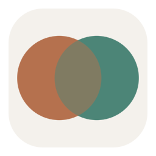

<div align="center">



# Ponte IA

**Claude e ChatGPT na mesma conversa — e um lendo a resposta do outro.**

App de mesa para Windows, feito em Electron.


</div>

---

## O problema

Quando a pergunta é difícil, a resposta de um único modelo é um ponto de vista
só. Perguntar aos dois ajuda — mas na prática vira um vaivém manual de copiar e
colar entre duas janelas, e nenhum dos dois chega a ver o que o outro
respondeu.

O Ponte IA faz esse trabalho: manda a mesma pergunta para os dois, mostra as
respostas lado a lado e, com um clique, faz cada um **ler e criticar** a
resposta do outro.

## Modos de conversa

| Modo | O que acontece |
|---|---|
| **Paralelo** | A mesma pergunta vai aos dois ao mesmo tempo. Nenhum vê o outro. |
| **Debate** | Claude responde → ChatGPT lê, critica e dá a versão dele → Claude replica ponto a ponto. |
| **Consenso** | Os dois respondem em paralelo, depois um deles sintetiza: onde concordam, onde divergem, resposta final. |
| **Individual** | Só um dos dois, quando você não precisa dos dois. |

Terminada qualquer rodada, aparece uma barra de acompanhamento:

```
e agora:  [⇄ cada um analisa o outro]  [→ Claude analisa]  [→ ChatGPT analisa]  [⚖ síntese]
```

Nada dispara sozinho — você lê as respostas e decide o próximo passo.

O prompt de análise cruzada é deliberadamente adversarial: pede onde o outro
acertou (em uma linha), onde errou ou omitiu, onde discorda **com fundamento**,
e o que revisa na própria resposta depois de ler. Fecha com uma trava contra
concordância automática — se o outro afirmou algo que não dá para verificar, tem
que marcar como não verificado em vez de aceitar por educação.

## Como funciona por dentro

```
┌──────────────────────────────────────────────┐
│  Interface (renderer)                        │
│  sem Node · sem rede · sem acesso a arquivo  │
│  CSP estrita, nenhum estilo inline           │
└───────────────────┬──────────────────────────┘
                    │  contextBridge (preload.js)
                    │  única superfície exposta
┌───────────────────▼──────────────────────────┐
│  Processo principal (main.js)                │
│  · chaves de API — safeStorage do Windows    │
│  · chamadas HTTP — sem restrição de CORS     │
│  · SSE das duas APIs → eventos normalizados  │
└──────────────────────────────────────────────┘
```

Três decisões que moldam o resto:

**As chaves salvas nunca voltam para a interface.** Ao salvar uma nova chave, ela
atravessa a ponte uma única vez e é imediatamente criptografada pelo processo
principal. Nas chamadas seguintes, a interface pede `{provider, body}` e o
processo principal resolve a credencial na hora. O SSE da Anthropic e o da
OpenAI é traduzido para os mesmos eventos antes de chegar na tela.

**Nada de modelo escrito na unha.** O app consulta `GET /v1/models` nos dois
provedores e monta as listas com o que a sua conta realmente libera — o que
significa que ele não envelhece quando sai modelo novo.

**Um histórico, duas visões.** Cada modelo recebe a mesma conversa reprojetada
do ponto de vista dele: as próprias falas como `assistant`, as do outro como
`user` com um rótulo explícito, e turnos consecutivos fundidos para respeitar a
alternância que as APIs exigem.

## Privacidade

- As chaves são gravadas com `safeStorage`, a criptografia do Windows —
  legíveis apenas pela conta de usuário que as salvou. Se essa proteção não
  estiver disponível, o app se recusa a gravar uma chave em texto claro.
- Conversas ficam em `%APPDATA%\Ponte IA`, no seu computador.
- A janela roda em sandbox, com `contextIsolation`, sem `nodeIntegration`, com
  IPC validado e uma CSP que não permite script nem estilo inline.
- O app envia mensagens e anexos apenas ao provedor ou aos provedores escolhidos
  no modo da conversa. Na OpenAI, cada chamada inclui `store: false`.
- Os provedores ainda podem aplicar as próprias políticas de retenção e
  monitoramento. Não envie dados sigilosos sem avaliar essas políticas.

## Instalação no Windows

Baixe o instalador ou a versão portátil na página de
[releases](https://github.com/Barkoski/ponte-ia/releases).

## Rodando

Para desenvolver ou gerar o pacote, use Node 22.12+ e Windows x64.

```bash
git clone https://github.com/Barkoski/ponte-ia.git
cd ponte-ia
npm ci
npm start
```

Para gerar o instalador e a versão portátil em `dist/`:

```bash
npm run dist
```

O ícone é gerado por código, sem dependência nenhuma — PNG e ICO escritos byte a
byte com o `zlib` do próprio Node:

```bash
npm run icon
```

### Chaves de API

O app precisa de duas chaves, cobradas por uso:

- **Anthropic** — [console.anthropic.com](https://console.anthropic.com) → API Keys
- **OpenAI** — [platform.openai.com](https://platform.openai.com) → API keys

Assinaturas do Claude.ai e do ChatGPT Plus **não servem**: são produtos
separados e nenhum dos dois libera acesso de API.

## Testes

```bash
npm test
```

Não é teste de unidade com mock — o script **sobe o aplicativo de verdade** e
roda mais de 30 verificações dentro de uma janela e de um perfil temporário:
carregamento sem erro de console, sandbox, isolamento do Node, escape de HTML,
rotulagem da resposta do outro modelo, anexos para as duas APIs, segredo ausente
do retorno à interface e criptografia no arquivo.

Dois defeitos reais que esses testes pegaram durante o desenvolvimento: a CSP
bloqueando estilos aplicados por código (o painel de raciocínio nunca teria
aparecido) e um escape de barra invertida que fazia todo bloco de código sair
cru na tela.

## Estrutura

```
src/
  main.js       processo principal — janela, menu, chaves, HTTP
  preload.js    contextBridge: a única ponte entre os dois mundos
  renderer.js   interface — conversa, markdown, orquestração dos modos
  index.html
  style.css
tools/
  make-icon.js  gera o ícone por código, sem dependências
  smoke.js      testes de integração com o app rodando
```

## Limitações conhecidas

- Só Windows. Nada no código impede macOS ou Linux, mas não foi testado nem
  empacotado para eles.
- PDFs e imagens vão aos dois provedores. A aceitação final depende do modelo
  escolhido e dos limites da conta.
- Uma conversa por vez. Não há histórico de sessões anteriores — só exportação
  em Markdown.
- Até 5 anexos por mensagem, 20 MB por arquivo e 40 MB no total. A conversa
  local é limitada a 60 MB.
- Os executáveis publicados ainda não têm assinatura de código; o Windows pode
  exibir um aviso do SmartScreen.

---

<details>
<summary><b>English summary</b></summary>

**Ponte IA** ("AI Bridge") is a Windows desktop app that puts Claude and ChatGPT
in the same conversation. Ask once, get both answers side by side, then have
each model read and critique the other's response.

Four modes: parallel, debate (Claude → GPT critique → Claude rebuttal),
consensus (both answer, one synthesizes), and single-model.

Built with Electron. Saved API keys are encrypted with the Windows `safeStorage`
API and are not returned to the renderer. HTTP happens in the main process.
Model lists are fetched from each provider's `/v1/models` rather than hardcoded.
Integration tests boot the real app with an isolated temporary profile.

Requires paid API keys from Anthropic and OpenAI — consumer Claude.ai and
ChatGPT Plus subscriptions do not grant API access.

MIT licensed.

</details>
